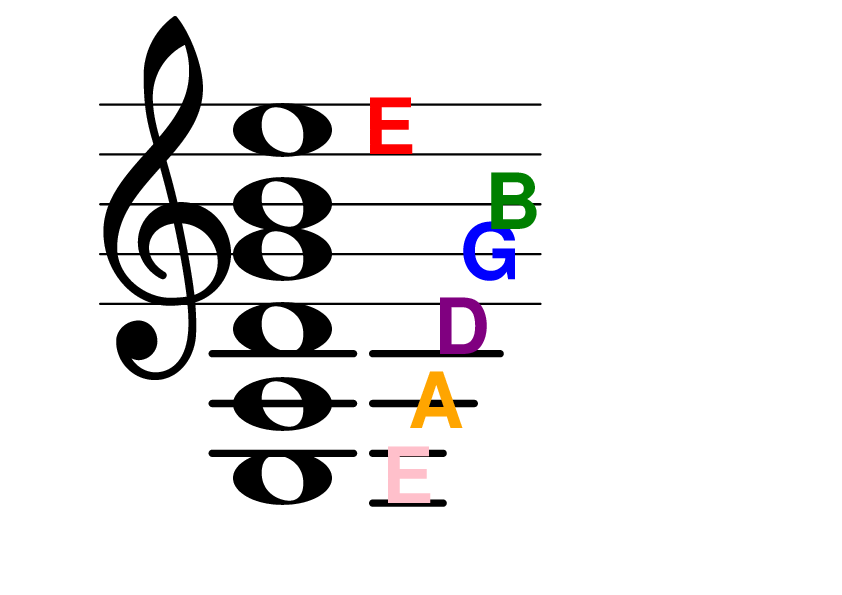

# Guitar stave
**@readwithai** - [X](https://x.com/readwithai) - [blog](https://readwithai.substack.com/) - [machine-aided reading](https://www.reddit.com/r/machineAidedReading/) - [📖](https://readwithai.substack.com/p/what-is-reading-broadly-defined
)[⚡️](https://readwithai.substack.com/s/technical-miscellany)[🖋️](https://readwithai.substack.com/p/note-taking-with-obsidian-much-of)

A stave (staff) with the notes of the open strings on a guitar (and bass on it).

## Motivation
I learned the guitar (and bass) without really being aware of notes - rather being aware of intervals. I imagine this is not uncommon, though perhaps pepole don't know the intervals. However, I am trying to build up some knowledge of notes and reading music to fit it more with the rest of society and notation they use.

For this purpose, I want to play guitar while looking at stave and being aware of which note I am playing, but I want a bit of a reference while doing this (so I want to add the open strings.

I could not find an image which did precisely what I want - so I am making my own with lilpond.

## Alternatives and prior work
I get the impression that recognising the note you are playing one a music instrument using an audio interface is a solved problem. There are certain tools which can show you the notes that you are playing on a stave as you play - and allow you to play along with songs. I wanted something freer.

There are various pictures on the internet but I could not find the one I wanted.
You could render this yourself with lilypond - or possible in a program like sibelius.

## Caveats
These labels are not properly aligned. Patches welcome.

## Remaking the image
Install lilypond. Run `lilypond guitar.lp`

## About me
I am **@readwithai**. I create tools for reading, research and agency sometimes using the markdown editor [Obsidian](https://readwithai.substack.com/p/what-exactly-is-obsidian).

I also create a [stream of tools](https://readwithai.substack.com/p/my-productivity-tools) that are related to this work and my life in general. This particular tool was created to give me interesting things to do on a treadmill.

I write about lots of things - including tools like this - on [X](https://x.com/readwithai).
My [blog](https://readwithai.substack.com/) is more about reading and research and agency.
